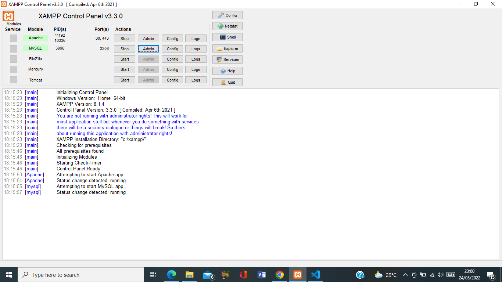
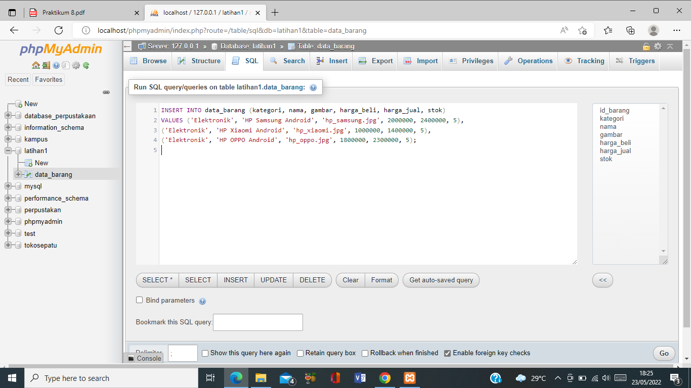

| Nama  |   Nova Tegar Adiyansyah |
| ------- |-----------------------|
| Nim   | 312010145     |
| Kelas | TI.20.A1  |

## Langkah langkah praktikum 8 

## 1. Menjalankan MySQL Server 

Untuk menjalankan MySQL Server dari menu XAMPP Contol.

## Mengakses MySQL Client menggunakan PHP MyAdmin

Pastikan webserver Apache dan MySQL server sudah dijalankan. Kemudian buka 
melalui browser: http://localhost/phpmyadmin

## 2. Membuat Database: Studi Kasus Data Barang
 ### Membuat Database
 

 ### Membuat tabel 
 

 ### Menambahkan data
 