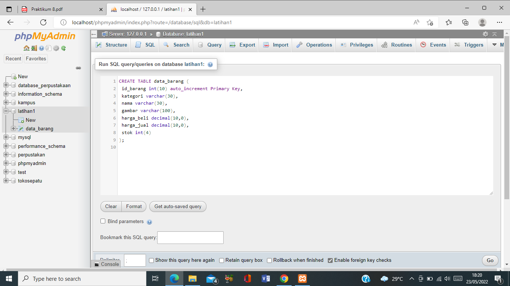

| Nama  |   Nova Tegar Adiyansyah |
| ------- |-----------------------|
| Nim   | 312010145     |
| Kelas | TI.20.A1  |

## Langkah langkah praktikum 8 

## 1. Menjalankan MySQL Server 

Untuk menjalankan MySQL Server dari menu XAMPP Contol.

## Mengakses MySQL Client menggunakan PHP MyAdmin

Pastikan webserver Apache dan MySQL server sudah dijalankan. Kemudian buka 
melalui browser: http://localhost/phpmyadmin

## 2. Membuat Database: Studi Kasus Data Barang
 ### Membuat Database
 

 ### Membuat tabel 
 

 ### Menambahkan data
 

 ## 3. Membuat Program CRUD
Buat folder lab8_php_database pada root directory web server (d:\xampp\htdocs)

Kemudian untuk mengakses direktory tersebut pada web server dengan mengakses URL: 
http://localhost/lab8_php_database

## Membuat file koneksi database
Buat file baru dengan nama koneksi.php

Buka melalui browser untuk menguji koneksi database (untuk menyampilkan pesan 
koneksi berhasil, uncomment pada perintah echo “koneksi berhasil”;

## Membuat file index untuk menampilkan data (Read)
Buat file baru dengan nama index.php

## Menambah Data (Create)
Buat file baru dengan nama tambah.php

## Mengubah Data (Update)
Buat file baru dengan nama ubah.php

## Menghapus Data (Delete)
Buat file baru dengan nama hapus.php

